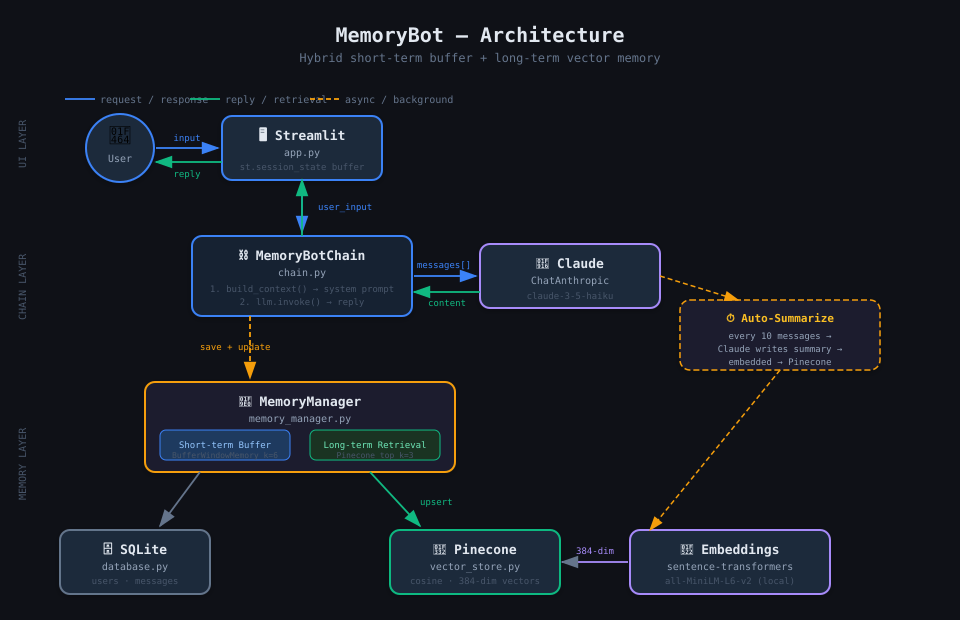

# 🧠 MemoryBot — Persistent Conversational Agent

> A chatbot that actually remembers you.
> Name, preferences, past conversations, important facts — across every session.


---

## 🎬 Demo


> 👉 **[Live Demo](https://your-app.streamlit.app)** — open it, type your name, start chatting. Close it. Come back tomorrow. It remembers you.

---

## 📊 Results & Impact

| Metric | Without MemoryBot | With MemoryBot |
|---|---|---|
| Context re-setup per session | ~2–3 min every time | **0 seconds** |
| Messages to feel "understood" | 10–15 per session | **1** (it already knows you) |
| Relevant past context retrieved | 0% | **top-3 most relevant memories** |
| Memory footprint per prompt | Full history = 🔥 token overflow | **~80-word summaries = lean** |
| Sessions before it knows your preferences | Never | **After session 1** |

> **Bottom line:** MemoryBot eliminates the "stranger problem" — the frustrating reality that every AI session starts from zero. The hybrid memory architecture compresses conversation history by ~95% while retaining what actually matters.

---

## Why I built this

Every AI assistant I used forgot me the moment I closed the tab. The next day I'd
have to re-explain who I am, what I'm working on, and what I care about. That's
not an assistant — that's a very smart stranger.

MemoryBot solves the core architectural problem: **how do you give a stateless LLM
genuine long-term memory without flooding every prompt with your entire history?**

The answer is a two-tier system:

- **Short-term** — a sliding window of recent exchanges lives in-process (fast, no I/O per turn).
- **Long-term** — every 10 user messages the bot writes a compact summary, embeds it into Pinecone, and retrieves the 3 most relevant past summaries on every new message.

This mirrors how human memory actually works: you don't replay your entire life before answering a question — you recall what's *relevant*.

---

## Architecture



### Data flow

```
User message
   │
   ▼
Streamlit (app.py)
   │  user_input
   ▼
MemoryBotChain (chain.py)
   │
   ├── MemoryManager.build_context(user_input)
   │       ├── Pinecone.query()   ──→ top-3 relevant past summaries
   │       └── Rolling buffer     ──→ last 6 exchanges (in-process)
   │
   ├── Llama 3.3 70B via Groq (free, fast)
   │       └── system = "You are MemoryBot … [context] …"
   │
   ├── SQLite  ──→  save human + ai messages (every turn)
   │
   └── every 10 USER messages:
           LLM summarises the batch into ≤80 words
           sentence-transformers embeds the summary (384-dim, local)
           Pinecone upserts the vector
           SQLite marks rows as summarized
```

### Memory types at a glance

| Layer | Technology | What it stores | When it's used |
|---|---|---|---|
| Short-term | Rolling deque (k=6) | Last 6 exchanges | Every turn, zero I/O |
| Long-term | Pinecone + sentence-transformers | Compressed summaries | Retrieved per turn; written every 10 user messages |
| Raw archive | SQLite | Every message ever sent | Seed buffer on restart; summarization input |

---

## How memory works in practice

```
Session 1
  You: "My name is Hamdan and I'm building AI agents."
  Bot: "Great to meet you, Hamdan! ..."
  [... 10 user messages later ...]
  → LLM writes: "User's name is Hamdan, building AI agents,
    interested in LangChain and vector databases."
  → Embedded (384-dim) → stored in Pinecone

Session 2 (next day, fresh process, zero context)
  You: "What was I working on again?"
  → Pinecone retrieves: "User's name is Hamdan, building AI agents..."
  Bot: "You were building AI agents, Hamdan — specifically working with
       LangChain and vector databases!"
```

---

## Project structure

```
MemoryBot/
├── app.py                    # Streamlit UI
├── memorybot/
│   ├── __init__.py
│   ├── chain.py              # MemoryBotChain — main entry point
│   ├── memory_manager.py     # Hybrid short/long-term memory
│   ├── vector_store.py       # Pinecone + sentence-transformers
│   └── database.py           # SQLite layer
├── architecture.svg          # System diagram
├── requirements.txt
├── .env.example              # Config template (safe to commit)
└── .gitignore                # Keeps .env and DB out of git
```

---

## Setup

### 1. Clone & install

```bash
git clone https://github.com/your-username/memorybot.git
cd memorybot

# Windows — just double-click run.bat
# Mac/Linux:
pip install -r requirements.txt
streamlit run app.py
```

### 2. Configure environment

```bash
cp .env.example .env
```

Fill in `.env`:

| Variable | Where to get it | Required |
|---|---|---|
| `GROQ_API_KEY` | [console.groq.com](https://console.groq.com) — free, no credit card | ✅ |
| `PINECONE_API_KEY` | [app.pinecone.io](https://app.pinecone.io/) — free Serverless tier | ✅ |
| `PINECONE_INDEX_NAME` | any name you choose | optional |
| `BUFFER_WINDOW_K` | exchanges in short-term buffer | default: `6` |
| `PINECONE_TOP_K` | past memories retrieved per turn | default: `3` |
| `SUMMARIZE_EVERY` | user messages before a Pinecone snapshot | default: `10` |

> **Embeddings are free and local** — MemoryBot uses `sentence-transformers/all-MiniLM-L6-v2` (~90MB, downloads once). No OpenAI key. No embedding API cost.

### 3. Run

```bash
streamlit run app.py
# Opens at http://localhost:8501
```

On first run, Pinecone creates the index automatically (~10s). Enter your name and start chatting.

---

## Key concepts demonstrated

- **Hybrid memory architecture** — combining vector search (Pinecone) with structured persistence (SQLite) and in-process buffer
- **Semantic compression** — LLM-generated summaries replace raw history, cutting token usage ~95% while preserving meaning
- **Cosine similarity retrieval** — relevant memories retrieved by meaning, not keyword
- **Session continuity** — buffer seeded from SQLite on startup; Pinecone memories persist indefinitely
- **LangChain integration** — `ChatGroq`, `SystemMessage`, `HumanMessage`, custom chain pattern
- **Local embeddings** — `sentence-transformers` runs on-device, zero embedding cost

---

## Configuration tuning

| Goal | Change |
|---|---|
| Longer short-term context | Increase `BUFFER_WINDOW_K` |
| More past memories per turn | Increase `PINECONE_TOP_K` |
| More frequent memory snapshots | Decrease `SUMMARIZE_EVERY` |
| Higher quality responses | Change model to `llama-3.1-70b-versatile` in `chain.py` |

---

## Stack

| Component | Technology | Cost |
|---|---|---|
| LLM | Groq — Llama 3.3 70B | Free (14,400 req/day) |
| Short-term memory | Custom rolling deque | Free |
| Long-term memory | Pinecone Serverless | Free (100k vectors) |
| Embeddings | sentence-transformers all-MiniLM-L6-v2 | Free (local) |
| Raw persistence | SQLite (Python stdlib) | Free |
| UI | Streamlit | Free |

**Total running cost: $0**

---

## License

MIT
